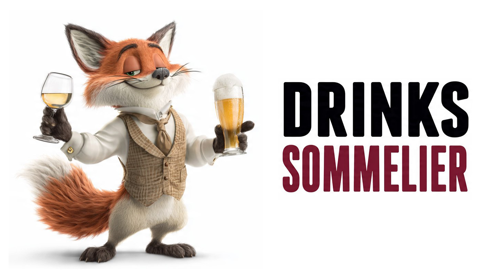

# drinks-sommelier

<p align="center">
  
</p>

<p align="center"><a href="../README.md">English</a> · <a href="README.zh-CN.md">简体中文</a> · <b>Português (Brasil)</b> · <a href="README.ja.md">日本語</a> · <a href="README.ko.md">한국어</a> · <a href="README.pt-BR.md">Português (Brasil)</a> · <a href="README.fr.md">Français</a> · <a href="README.de.md">Deutsch</a> · <a href="README.ru.md">Русский</a> · <a href="README.ar.md">العربية</a> · <a href="README.hi.md">हिन्दी</a> · <a href="README.it.md">Italiano</a></p>

<p align="center">
  <strong>Um sommelier no seu bolso, sempre ao seu lado.</strong><br>
  <em>Prateleiras, cardápios, adegas: onde quer que você esteja, ele sabe o que recomendar.</em>
</p>

> **Uma skill para agentes de IA.** OpenClaw, Hermes Agent, OpenCode, Claude Code, Cursor e além.
> Um sommelier virtual especializado em cervejas e vinhos que aprende seus gostos
> pessoais e sugere a melhor escolha de qualquer prateleira, cardápio
> ou lista. **Gratuito, open-source, auto-hospedado.**

---

## Por que existe

No restaurante, no pub, na vinícola, no supermercado: o problema é sempre
o mesmo. **Dezenas de opções e nenhuma certeza** sobre o que escolher que seja
verdadeiramente adequado ao seu gosto.

Você poderia perguntar ao garçom, abrir cinco abas no celular, ou
torcer para que o nome mais bonito também seja o melhor. Ou você pode perguntar
ao seu agente de IA — e ele já sabe do que você gosta.

**drinks-sommelier** ensina qualquer agente de IA a atuar como um
sommelier pessoal. O agente:

1. Aprende suas preferências de gosto, de uma vez por todas
2. Analisa qualquer entrada: foto de uma prateleira, cardápios digitais, listas
   de nomes escritas pelo usuário
3. Pesquisa informações atualizadas sobre cada produto
4. Compara cada produto com seu perfil de gosto
5. Diz exatamente o que escolher — e por quê

Tudo de forma transparente, honesta, gratuita e sem inventar nada.

---

## Benefícios

- **Aprende seus gostos com o tempo.** Quanto mais você usa a skill, mais o agente
  conhece seu paladar. Cada interação refina o perfil.

- **Cervejas e vinhos em uma única skill.** Você não precisa instalar duas skills
  separadas. O agente lida com ambas as categorias, reconhecendo automaticamente
  o que está analisando.

- **Análise a partir de imagens e texto.** Tire uma foto de uma prateleira, um cardápio,
  uma carta de vinhos. Ou escreva uma lista. O agente extrai apenas
  os produtos relevantes (cervejas e vinhos), ignorando todo o resto.

- **Sem alucinações.** O agente tem a proibição absoluta de usar
  seu próprio conhecimento de pré-treinamento. Cada produto é
  prontamente pesquisado na web antes de ser avaliado.

- **Índice de preferência 0-100%.** Cada sugestão tem uma pontuação
  clara que indica o quão bem um produto se adequa ao seu gosto. Sem
  meios-termos.

- **Perfil de gosto persistente.** Suas preferências são salvas em
  arquivos de texto legíveis e editáveis. Elas não se perdem entre
  uma sessão e outra.

- **Configuração guiada pelo agente.** Na primeira vez, o agente faz as
  perguntas certas para entender seus gostos, sem te deixar diante de
  configurações manuais.

- **Open-source, licença MIT.** Gratuito, sem assinaturas, sem
  chaves de API, sem limites. Você pode usá-lo, modificá-lo, distribuí-lo.

- **Funciona com qualquer agente de IA.** Escrito para OpenCode, mas
  facilmente conversível para OpenClaw, Hermes Agent, Claude Code, Cursor,
  GitHub Copilot e qualquer outro agente. Mostre este README ao seu
  agente para uma conversão simples e automática.

- **Totalmente personalizável.** SKILL.md é um arquivo de texto.
  Adicione regras, modifique critérios, adapte-o ao seu fluxo de trabalho.

---

⭐ **Gosta do drinks-sommelier?** Dê uma estrela, siga o projeto
e ajude-o a crescer. As melhores recomendações são aquelas que
se compartilham — sugestões e contribuições são sempre bem-vindas.

---

## Como funciona

O processo é dividido em 5 fases, executadas em sequência pelo agente toda
vez que ele é consultado.

### Fase 1 — Configuração do perfil de gosto (única)

Na primeira vez que a skill é carregada, o agente verifica se os
parágrafos "Gostos do usuário para cervejas" e "Gostos do usuário para
vinhos" no SKILL.md já foram preenchidos.

Se não foram, o agente abre o arquivo `data/SETUP.md` que contém:
- Perguntas orientadoras para coletar preferências (doce/amargo, teor alcoólico,
  estilos apreciados e não apreciados, etc.)
- Exemplos de parágrafos preenchidos corretamente
- Exemplos de arquivos `data/` populados

O agente faz as perguntas, coleta as respostas e modifica
os dois parágrafos de gosto no SKILL.md. Se durante a
configuração o usuário mencionar produtos específicos, o agente
os registra nos arquivos `data/` correspondentes (operação
opcional, mas útil para refinar o perfil).

Você também pode preencher os parágrafos manualmente, se preferir.

Os arquivos `data/known-preferred-beers.md` e `data/known-preferred-wines.md`
são opcionais e contêm produtos específicos que você já avaliou
no passado. Quanto mais completos estiverem, mais o agente entende suas nuances.

### Fase 2 — Análise da entrada

O agente identifica o que você tem disponível e em qual formato:

- **Texto**: extrai os nomes de cervejas e vinhos de uma lista escrita
- **Imagem**: analisa a foto (prateleira, cardápio, carta de vinhos) e
  reconhece apenas produtos que sejam cervejas ou vinhos.
  Ignora completamente: destilados, licores, petiscos, refeições,
  sobremesas, refrigerantes, acessórios. Qualquer coisa que não seja cerveja ou vinho.
- **Misto**: se você enviar texto e imagens, analisa tudo.

Se a entrada não estiver clara, o agente pergunta antes de prosseguir.

### Fase 3 — Pesquisa web (antialucinação)

O agente tem a **proibição absoluta** de usar seu próprio
conhecimento de pré-treinamento para avaliar um produto. Ele poderia estar obsoleto,
impreciso, ou pior: inventado. Por isso, realiza uma pesquisa web direcionada
em cada e todo produto identificado.

O que o agente pesquisa:

| Categoria | Informações coletadas |
|---|---|
| **Cervejas** | Estilo, teor alcoólico, dulçor, amargor (IBU), corpo, notas aromáticas, ingredientes |
| **Vinhos** | Variedade de uva, denominação, região de produção, safra, corpo, acidez, taninos, teor alcoólico, notas de dulçor |

Se um produto não for encontrado online, o agente afirma honestamente
e não inventa características.

### Fase 4 — Avaliação

O agente compara cada produto com seu perfil de gosto, que possui
dois níveis distintos:

1. **Regras de gosto** — as diretrizes gerais que você escreveu
   nos parágrafos de gosto (ex.: "cervejas doces", "vinhos não muito
   doces", "teor alcoólico ≤ 9°"). Elas são vinculantes.
2. **Produtos nos arquivos data/** — exemplos concretos de cervejas e vinhos
   que você gostou ou não. Eles servem para calibrar as
   regras de gosto (ex.: se você ama a cerveja X e odeia a Y, o agente
   entende o que você quer dizer com "doce" e "amargo").

O agente atribui um **índice de preferência de 0 a 100%**:

| Índice | Significado |
|---|---|
| 90-100% | Produto perfeito para seu gosto |
| 70-89% | Excelente, pequenas discrepâncias |
| 50-69% | Aceitável, mas não ideal |
| 30-49% | Pouco adequado ao seu gosto |
| 0-29% | Evitar |

Se você indicou um contexto alimentar, o agente também avalia
a harmonização (prioridade secundária).

### Fase 5 — Recomendação

O agente estrutura a resposta claramente:

1. **Primeira escolha**: o melhor produto com índice de preferência
   e explicação de por que é adequado ao seu gosto
2. **Alternativas** (se houver): em ordem decrescente de preferência
3. **Harmonizações**: sugestões de harmonização para os produtos
4. **Produtos a evitar**: aqueles que claramente não respeitam
   seu gosto, com explicação

---

## Estrutura do projeto

```
drinks-sommelier/
├── README.md                ← Este arquivo
├── LICENSE                  ← Licença MIT
├── .gitignore
├── img/                     ← Logotipo e recursos gráficos
├── i18n/                    ← Traduções
└── skills/
    └── drinks-sommelier/    ← A skill propriamente dita
        ├── SKILL.md         ← Instruções completas para o agente
        │                      (frontmatter, gostos, operações,
        │                       casos extremos, melhores práticas, exemplos,
        │                       atualizações de preferências)
        └── data/
            ├── SETUP.md                   ← Guia de configuração inicial
            │                                (usado apenas no primeiro início)
            ├── known-preferred-beers.md   ← Cervejas apreciadas e não apreciadas
            │                                (a ser preenchido com o uso)
            └── known-preferred-wines.md   ← Vinhos apreciados e não apreciados
                                              (a ser preenchido com o uso)
```

---

## Instalação

Você pode instalar a skill de duas maneiras:

### Com npx skills (recomendado)

```bash
npx skills add Johell1NS/drinks-sommelier --skill drinks-sommelier
```

### Com git clone

```bash
git clone https://github.com/Johell1NS/drinks-sommelier.git
```

> **Nota:** diferentemente do `npx skills add`, o git clone não sabe onde
> as skills do seu agente estão armazenadas. Você precisa colocar a skill no caminho
> correto para seu agente (ex.: OpenCode usa `~/.config/opencode/skills/`,
> outros agentes podem diferir). Uma vez lá, o agente a detecta
> automaticamente.

---

## Configuração

A skill precisa conhecer seus gostos para funcionar. Você pode
configurá-la de duas maneiras:

### Configuração guiada (recomendada)

Após instalar a skill, peça ao seu agente algo como
"Me ajude a configurar a skill drinks-sommelier". O agente carregará
o SKILL.md, encontrará os parágrafos de gosto ainda a serem preenchidos e
guiará você pela configuração inicial usando `data/SETUP.md`.

Alternativamente, simplesmente peça uma recomendação de cerveja ou vinho:
o agente detectará automaticamente que a skill não está inicializada
e fará as perguntas certas.

### Configuração manual

Abra `SKILL.md` e preencha os parágrafos:

**Gostos do usuário para cervejas**
```
Prefiro cervejas doces e não amargas.
Não devem ultrapassar 9° de teor alcoólico.
Gosto de estilos belgas e cervejas frutadas.
Não gosto de IPAs, stouts e cervejas muito amargas.
```

**Gostos do usuário para vinhos**
```
Prefiro vinhos tintos não muito doces.
Para brancos, prefiro vermentino e sauvignon.
Gosto de vinhos com boa acidez e frescor.
Não gosto de vinhos passito ou fortificados.
```

Você também pode preencher os arquivos `data/known-preferred-beers.md` e
`data/known-preferred-wines.md` com produtos específicos que você já
experimentou e avaliou. Esta parte é opcional, mas útil
para refinar o perfil.

**Exemplo — `data/known-preferred-beers.md`**
```
# CERVEJAS APRECIADAS
- Kwak
- Triple Karmeliet
- La Trappe Blond
- Flea Margherita

# CERVEJAS NÃO APRECIADAS
- Qualquer IPA
- Stout
- Cervejas com teor alcoólico acima de 9°
```

**Exemplo — `data/known-preferred-wines.md`**
```
# VINHOS APRECIADOS
- Vermentino Costamolino
- Syrah Soraia Casale Valle Chiesa
- Rebeca Firriato

# VINHOS NÃO APRECIADOS
- Vinhos passito
- Vinhos fortificados
```

### Atualização ao longo do tempo

Cada vez que você expressa um julgamento sobre um produto ("Gostei deste",
"Não gostei deste"), o agente atualiza automaticamente os
arquivos `data/`. As regras de gosto nos parágrafos do SKILL.md, por outro lado,
são atualizadas apenas com sua confirmação explícita, porque
são vinculantes para avaliações futuras.

---

## Exemplos de uso

### Cenário 1 — Prateleira de vinhos (imagem)
Você tira uma foto de uma prateleira de uma loja de vinhos. O agente identifica os vinhos,
pesquisa todos na web, compara com seu perfil. Ele diz
qual escolher, por que e com o que harmonizar.

### Cenário 2 — Cardápio de cervejas (imagem)
Você tira uma foto do cardápio de cervejas de um pub. O agente ignora coquetéis,
destilados, etc... analisa apenas as cervejas, pesquisa informações sobre
cada uma. Sugere a cerveja mais adequada ao seu gosto.

### Cenário 3 — Lista de texto mista
Você escreve "Tenho estes vinhos: Chianti Classico, Vermentino Costamolino,
Amarone. E estas cervejas: Kwak, IPA artesanal local, Leffe Blonde."
O agente avalia ambas as categorias e diz qual é a melhor
escolha no geral.

### Cenário 4 — Solicitação sem lista
"Preciso de um vinho para um jantar, o que você recomenda?" O agente
não inventa. Ele pergunta o que você tem disponível, que tipo de jantar
e se você já tem algum vinho em mente.

### Cenário 5 — Nova preferência expressa
Após uma sugestão, você diz "Gostei muito daquela cerveja".
O agente a adiciona aos seus favoritos e atualiza o perfil
para ser ainda mais preciso na próxima vez.

---

## O que esta skill NÃO faz

- **Não fornece avaliações profissionais de degustação.** As
  sugestões são baseadas em dados objetivos (estilo, teor alcoólico,
  amargor) e em preferências declaradas. Não substitui um
  sommelier humano em contextos formais.

- **Não lida com outras bebidas.** Destilados, coquetéis, licores,
  refrigerantes, bebidas não alcoólicas — qualquer coisa que não seja cerveja ou vinho é
  ignorada.

---

## Sugestões (opcional)

**drinks-sommelier** funciona com qualquer ferramenta de pesquisa web que seu agente
suporte nativamente. Se seu agente já tem capacidades confiáveis de pesquisa web,
você não precisa de mais nada.

No entanto, se você quiser garantir pesquisas completas e resistentes a antibot
todas as vezes (especialmente útil quando páginas de produtos estão atrás de sistemas antibot),
considere instalar a skill complementar
**[browser-search](https://github.com/Johell1NS/browser-search)**.
Ela pesquisa em dezenas de mecanismos simultaneamente e ajuda o agente a encontrar
informações sobre produtos mesmo quando as ferramentas padrão têm dificuldades.

---

## Licença
MIT
